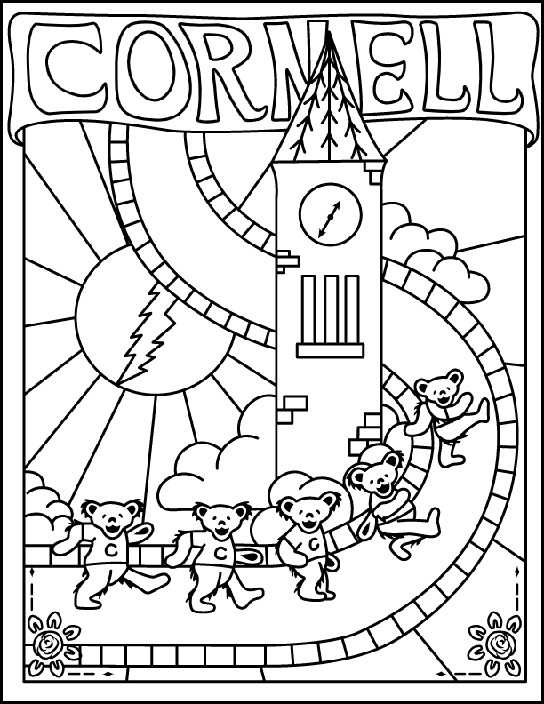

# Coloring Book
This jQuery web application is developed to let users enjoy digital coloring.  The original app is copyrighted to Cornell University and has been released under the Apache 2.0 license. You may download and modify the code to include your coloring pages, color pallet, and branding.  By default, the homepage has links to this repo and the original app in the footer.  You may remove that.  You may also rename your page title, remove the demo coloring sheet, and remove any reference to Cornell. 

## Live demo
Check out what you can build using the code of this repository.
https://app.aad.cornell.edu/coloring-book/

Contact: web@aad.cornell.edu

## Add coloring pages
The app includes one SVG image (1.svg) for demonstration.  Feel free to remove or keep the demo image.
You can add multiple SVG images.  The file names are mentioned in game.js, index.html, and the /thumbnails folder.  

The app only accepts vector images in SVG format with the proper CSS fill class attached to each path.
To create a compatible SVG image, we used Adobe Illustrator, and here are the steps we took to export the correct format.
- Select the entire drawing, click "Expand Appearance", then "Exapand (check both Fill and stroke)".
- Click "Pathfinder" on the menu, then choose "Merge".
- Click "File" on the menu, then "Save as > SVG", (Don’t use “File > Export” because it doesn’t give you any advanced options). Click “Advanced Options” from this window, and choose “CSS Properties: Style Element”.
- By default, Illustrator automatically assigns CSS class 'st0' or 'cls-1' to all the paths in the SVG.  But if your SVG has a different class name, you need to edit the game.js file and update this line:
```
    svgColor = $('.cls-1');
```
The app will only work if the same CSS class name is used in both game.js and all the SVG images.

## Add thumbnails
For each coloring page, you need an SVG image and a .png thumbnail in the /thumbnails folder.  The thumbnail is for the gallery modal. 

## Add links to your homepage
Add links to the thumbnail to the gallery block on the index.html file.
```
    <div class="gallery-block">
          <button
            class="gallery-option"
            data-id="1"
            aria-label="button to choose the McGraw Tower image"
          >
            
          </button>
        </div>
```

## Alter footer reference
Links to this GitHub repo and the original Cornell Coloring Book app are included in the footer of the index.html template.
You can relocate or remove the information.

